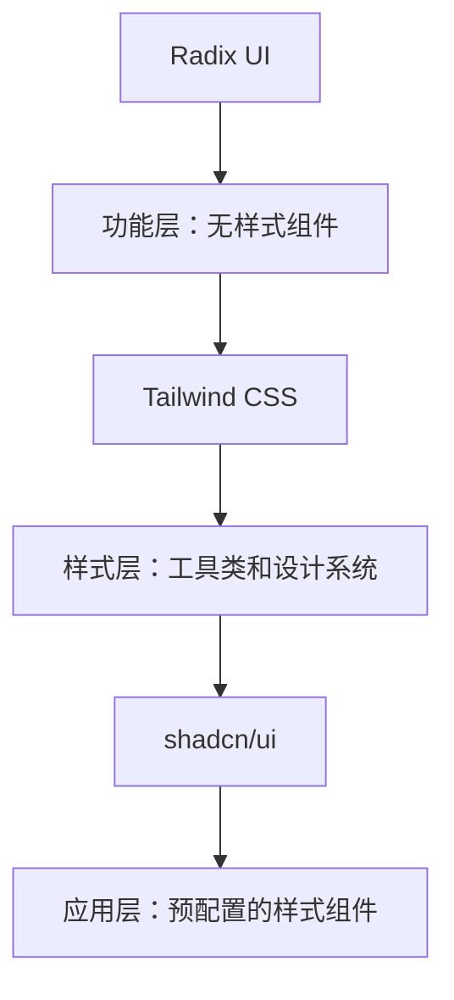

# shadcn/ui 配置指南

## 1. 前置要求

在配置 shadcn/ui 之前，确保你的项目满足以下要求：

- ✅ React 项目
- ✅ TypeScript 项目
- ✅ Tailwind CSS 已配置
- ✅ 支持 CSS 变量

## 2. 安装依赖

### 2.1 安装 Tailwind CSS 及相关依赖

```bash
# 安装 Tailwind CSS 和相关依赖
pnpm add -D tailwindcss postcss autoprefixer
pnpm add @tailwindcss/typography

# 初始化 Tailwind 配置
pnpx tailwindcss init -p
```

### 2.2 安装 shadcn/ui CLI

```bash
# 使用 dlx 运行 shadcn/ui 初始化
pnpm dlx shadcn@latest init
```

## 3. 配置步骤

### 3.1 Tailwind CSS 配置

#### 修改 `tailwind.config.js`

```javascript
/** @type {import('tailwindcss').Config} */
export default {
  darkMode: ["class"],
  content: [
    './pages/**/*.{ts,tsx}',
    './components/**/*.{ts,tsx}',
    './app/**/*.{ts,tsx}',
    './src/**/*.{ts,tsx}',
  ],
  prefix: "",
  theme: {
    container: {
      center: true,
      padding: "2rem",
      screens: {
        "2xl": "1400px",
      },
    },
    extend: {
      colors: {
        border: "hsl(var(--border))",
        input: "hsl(var(--input))",
        ring: "hsl(var(--ring))",
        background: "hsl(var(--background))",
        foreground: "hsl(var(--foreground))",
        primary: {
          DEFAULT: "hsl(var(--primary))",
          foreground: "hsl(var(--primary-foreground))",
        },
        secondary: {
          DEFAULT: "hsl(var(--secondary))",
          foreground: "hsl(var(--secondary-foreground))",
        },
        destructive: {
          DEFAULT: "hsl(var(--destructive))",
          foreground: "hsl(var(--destructive-foreground))",
        },
        muted: {
          DEFAULT: "hsl(var(--muted))",
          foreground: "hsl(var(--muted-foreground))",
        },
        accent: {
          DEFAULT: "hsl(var(--accent))",
          foreground: "hsl(var(--accent-foreground))",
        },
        popover: {
          DEFAULT: "hsl(var(--popover))",
          foreground: "hsl(var(--popover-foreground))",
        },
        card: {
          DEFAULT: "hsl(var(--card))",
          foreground: "hsl(var(--card-foreground))",
        },
      },
      borderRadius: {
        lg: "var(--radius)",
        md: "calc(var(--radius) - 2px)",
        sm: "calc(var(--radius) - 4px)",
      },
      keyframes: {
        "accordion-down": {
          from: { height: "0" },
          to: { height: "var(--radix-accordion-content-height)" },
        },
        "accordion-up": {
          from: { height: "var(--radix-accordion-content-height)" },
          to: { height: "0" },
        },
      },
      animation: {
        "accordion-down": "accordion-down 0.2s ease-out",
        "accordion-up": "accordion-up 0.2s ease-out",
      },
    },
  },
  plugins: [require("tailwindcss-animate")],
}
```

#### 修改 `src/index.css`

```css
@tailwind base;
@tailwind components;
@tailwind utilities;

@layer base {
  :root {
    --background: 0 0% 100%;
    --foreground: 222.2 84% 4.9%;
    --card: 0 0% 100%;
    --card-foreground: 222.2 84% 4.9%;
    --popover: 0 0% 100%;
    --popover-foreground: 222.2 84% 4.9%;
    --primary: 222.2 47.4% 11.2%;
    --primary-foreground: 210 40% 98%;
    --secondary: 210 40% 96%;
    --secondary-foreground: 222.2 47.4% 11.2%;
    --muted: 210 40% 96%;
    --muted-foreground: 215.4 16.3% 46.9%;
    --accent: 210 40% 96%;
    --accent-foreground: 222.2 47.4% 11.2%;
    --destructive: 0 84.2% 60.2%;
    --destructive-foreground: 210 40% 98%;
    --border: 214.3 31.8% 91.4%;
    --input: 214.3 31.8% 91.4%;
    --ring: 222.2 84% 4.9%;
    --radius: 0.5rem;
  }

  .dark {
    --background: 222.2 84% 4.9%;
    --foreground: 210 40% 98%;
    --card: 222.2 84% 4.9%;
    --card-foreground: 210 40% 98%;
    --popover: 222.2 84% 4.9%;
    --popover-foreground: 210 40% 98%;
    --primary: 210 40% 98%;
    --primary-foreground: 222.2 47.4% 11.2%;
    --secondary: 217.2 32.6% 17.5%;
    --secondary-foreground: 210 40% 98%;
    --muted: 217.2 32.6% 17.5%;
    --muted-foreground: 215 20.2% 65.1%;
    --accent: 217.2 32.6% 17.5%;
    --accent-foreground: 210 40% 98%;
    --destructive: 0 62.8% 30.6%;
    --destructive-foreground: 210 40% 98%;
    --border: 217.2 32.6% 17.5%;
    --input: 217.2 32.6% 17.5%;
    --ring: 212.7 26.8% 83.9%;
  }
}

@layer base {
  * {
    @apply border-border;
  }
  body {
    @apply bg-background text-foreground;
  }
}
```

### 3.2 shadcn/ui 初始化配置

运行初始化命令后，会创建以下文件：

#### `components.json`

```json
{
  "$schema": "https://ui.shadcn.com/schema.json",
  "style": "default",
  "rsc": false,
  "tsx": true,
  "tailwind": {
    "config": "tailwind.config.js",
    "css": "src/index.css",
    "baseColor": "slate",
    "cssVariables": true,
    "prefix": ""
  },
  "aliases": {
    "components": "@/components",
    "utils": "@/lib/utils"
  }
}
```

#### `src/lib/utils.ts`

```typescript
import { type ClassValue, clsx } from "clsx"
import { twMerge } from "tailwind-merge"

export function cn(...inputs: ClassValue[]) {
  return twMerge(clsx(inputs))
}
```

## 3. 架构说明：为什么使用 Radix UI？

### 3.1 shadcn/ui 与 Radix UI 的关系

shadcn/ui 不是一个独立的组件库，而是建立在 **Radix UI** 之上的配置和样式层。理解这种架构关系对于正确使用 shadcn/ui 至关重要。

### 3.2 样式工具说明：clsx 和 tailwind-merge

#### 🎯 clsx - 条件类名管理

`clsx` 是一个轻量级的工具库，用于处理条件类名组合：

```typescript
// 基本用法
clsx('btn', 'btn-primary') // => 'btn btn-primary'

// 条件类名
clsx('btn', {
  'btn-primary': isPrimary,
  'btn-disabled': isDisabled,
  'btn-large': size === 'large'
})

// 数组和嵌套对象
clsx(['btn', 'btn-primary'], { 'btn-disabled': true })
```

**在 shadcn/ui 中的作用**：
- 处理组件的条件样式（如 `variant`、`size` 等属性）
- 合并用户传入的 `className` 和组件默认样式
- 提供类型安全的类名组合

#### 🎨 tailwind-merge - Tailwind 类名冲突解决

`tailwind-merge` 专门用于解决 Tailwind CSS 类名冲突问题：

```typescript
// 冲突示例
const classes = 'bg-red-500 bg-blue-500'
// 期望结果：'bg-blue-500'（后者覆盖前者）

twMerge('bg-red-500 bg-blue-500') // => 'bg-blue-500'
twMerge('px-2 py-4 p-3') // => 'p-3'
twMerge('text-sm text-lg') // => 'text-lg'
```

**在 shadcn/ui 中的作用**：
- 防止 Tailwind 类名冲突
- 确保样式优先级正确
- 优化最终的 CSS 输出

#### 🔧 cn 工具函数

`cn` 函数结合了 `clsx` 和 `tailwind-merge` 的最佳特性：

```typescript
// 实际使用示例
const Button = ({ variant, size, className, ...props }) => (
  <button
    className={cn(
      buttonVariants({ variant, size }), // 基础样式
      className // 用户自定义样式
    )}
    {...props}
  />
)

// 使用示例
<Button variant="primary" size="lg" className="my-custom-class" />
// 结果：合并基础样式和自定义样式，并解决可能的冲突
```

**工作流程**：
1. `clsx` 处理条件逻辑和类名组合
2. `tailwind-merge` 解决 Tailwind 类名冲突
3. 返回优化后的类名字符串


#### 三层架构模型：



### 3.3 Radix UI 的核心价值

#### 🎯 可访问性 (a11y) 保证
- **完整的键盘导航** - 所有组件都支持键盘操作
- **屏幕阅读器优化** - 自动管理 ARIA 属性
- **焦点管理** - 复杂的焦点陷阱和焦点恢复

#### 🎨 无头设计 (Headless)
- **零样式依赖** - 不强制任何设计语言
- **完全可控** - 你可以完全控制组件外观
- **无样式冲突** - 不会与你的设计系统冲突

#### 🔧 功能完整性
- **复杂交互模式** - 下拉菜单、对话框、弹出框等
- **状态管理** - 内置的状态和事件处理
- **类型安全** - 完整的 TypeScript 支持

### 3.4 实际工作流程示例

以按钮组件为例：

```tsx
// Radix UI 提供功能（无样式）
import * as ButtonPrimitive from "@radix-ui/react-button"

// shadcn/ui 提供样式（基于 Tailwind）
const Button = React.forwardRef<
  React.ElementRef<typeof ButtonPrimitive.Root>,
  React.ComponentPropsWithoutRef<typeof ButtonPrimitive.Root>
>(({ className, variant, size, ...props }, ref) => {
  return (
    <ButtonPrimitive.Root
      className={cn(buttonVariants({ variant, size, className }))}
      ref={ref}
      {...props}
    />
  )
})
```

### 3.5 为什么选择这种架构？

| 方案 | 优点 | 缺点 |
|------|------|------|
| **Radix UI + shadcn/ui** | ✅ 最佳可访问性<br>✅ 完全样式控制<br>✅ 类型安全<br>✅ 无样式冲突 | ⚠️ 需要额外配置 |
| **传统 UI 库** | ✅ 开箱即用 | ❌ 样式耦合<br>❌ 定制困难<br>❌ 可访问性问题 |
| **完全自定义** | ✅ 完全控制 | ❌ 开发成本高<br>❌ 可访问性难保证 |

### 3.6 安装必要的依赖

#### 🎯 核心依赖（必须安装）

```bash
# 安装基础工具库
pnpm add clsx tailwind-merge

# 初始化 shadcn/ui
pnpm dlx shadcn@latest init
```

#### 🔄 Radix UI 的安装说明

**重要**：你**不需要**手动安装 Radix UI 组件！当使用 shadcn/ui 添加组件时，对应的 Radix UI 包会自动安装。

```bash
# 示例：添加按钮组件
pnpm dlx shadcn@latest add button

# 这会自动：
# 1. 安装 @radix-ui/react-button
# 2. 创建 src/components/ui/button.tsx
# 3. 配置好样式和类型
```

#### ⚠️ 何时需要手动安装 Radix UI？

只有在以下特殊情况下才需要手动安装：

```bash
# 情况1：直接使用 Radix UI 原语（不使用 shadcn/ui 包装）
pnpm add @radix-ui/react-dialog

# 情况2：使用 shadcn/ui 不包含的 Radix UI 组件
pnpm add @radix-ui/react-toast

# 情况3：需要特定版本的 Radix UI
pnpm add @radix-ui/react-dialog@1.0.0
```

#### 🎁 可选依赖

```bash
# 图标库（可选）
pnpm add lucide-react
```

## 4. 配置步骤

### 4.1 Tailwind CSS 配置

#### 修改 `tailwind.config.js`

```javascript
/** @type {import('tailwindcss').Config} */
export default {
  darkMode: ["class"],
  content: [
    './pages/**/*.{ts,tsx}',
    './components/**/*.{ts,tsx}',
    './app/**/*.{ts,tsx}',
    './src/**/*.{ts,tsx}',
  ],
  prefix: "",
  theme: {
    container: {
      center: true,
      padding: "2rem",
      screens: {
        "2xl": "1400px",
      },
    },
    extend: {
      colors: {
        border: "hsl(var(--border))",
        input: "hsl(var(--input))",
        ring: "hsl(var(--ring))",
        background: "hsl(var(--background))",
        foreground: "hsl(var(--foreground))",
        primary: {
          DEFAULT: "hsl(var(--primary))",
          foreground: "hsl(var(--primary-foreground))",
        },
        secondary: {
          DEFAULT: "hsl(var(--secondary))",
          foreground: "hsl(var(--secondary-foreground))",
        },
        destructive: {
          DEFAULT: "hsl(var(--destructive))",
          foreground: "hsl(var(--destructive-foreground))",
        },
        muted: {
          DEFAULT: "hsl(var(--muted))",
          foreground: "hsl(var(--muted-foreground))",
        },
        accent: {
          DEFAULT: "hsl(var(--accent))",
          foreground: "hsl(var(--accent-foreground))",
        },
        popover: {
          DEFAULT: "hsl(var(--popover))",
          foreground: "hsl(var(--popover-foreground))",
        },
        card: {
          DEFAULT: "hsl(var(--card))",
          foreground: "hsl(var(--card-foreground))",
        },
      },
      borderRadius: {
        lg: "var(--radius)",
        md: "calc(var(--radius) - 2px)",
        sm: "calc(var(--radius) - 4px)",
      },
      keyframes: {
        "accordion-down": {
          from: { height: "0" },
          to: { height: "var(--radix-accordion-content-height)" },
        },
        "accordion-up": {
          from: { height: "var(--radix-accordion-content-height)" },
          to: { height: "0" },
        },
      },
      animation: {
        "accordion-down": "accordion-down 0.2s ease-out",
        "accordion-up": "accordion-up 0.2s ease-out",
      },
    },
  },
  plugins: [require("tailwindcss-animate")],
}
```

#### 修改 `src/index.css`

```css
@tailwind base;
@tailwind components;
@tailwind utilities;

@layer base {
  :root {
    --background: 0 0% 100%;
    --foreground: 222.2 84% 4.9%;
    --card: 0 0% 100%;
    --card-foreground: 222.2 84% 4.9%;
    --popover: 0 0% 100%;
    --popover-foreground: 222.2 84% 4.9%;
    --primary: 222.2 47.4% 11.2%;
    --primary-foreground: 210 40% 98%;
    --secondary: 210 40% 96%;
    --secondary-foreground: 222.2 47.4% 11.2%;
    --muted: 210 40% 96%;
    --muted-foreground: 215.4 16.3% 46.9%;
    --accent: 210 40% 96%;
    --accent-foreground: 222.2 47.4% 11.2%;
    --destructive: 0 84.2% 60.2%;
    --destructive-foreground: 210 40% 98%;
    --border: 214.3 31.8% 91.4%;
    --input: 214.3 31.8% 91.4%;
    --ring: 222.2 84% 4.9%;
    --radius: 0.5rem;
  }

  .dark {
    --background: 222.2 84% 4.9%;
    --foreground: 210 40% 98%;
    --card: 222.2 84% 4.9%;
    --card-foreground: 210 40% 98%;
    --popover: 222.2 84% 4.9%;
    --popover-foreground: 210 40% 98%;
    --primary: 210 40% 98%;
    --primary-foreground: 222.2 47.4% 11.2%;
    --secondary: 217.2 32.6% 17.5%;
    --secondary-foreground: 210 40% 98%;
    --muted: 217.2 32.6% 17.5%;
    --muted-foreground: 215 20.2% 65.1%;
    --accent: 217.2 32.6% 17.5%;
    --accent-foreground: 210 40% 98%;
    --destructive: 0 62.8% 30.6%;
    --destructive-foreground: 210 40% 98%;
    --border: 217.2 32.6% 17.5%;
    --input: 217.2 32.6% 17.5%;
    --ring: 212.7 26.8% 83.9%;
  }
}

@layer base {
  * {
    @apply border-border;
  }
  body {
    @apply bg-background text-foreground;
  }
}
```

### 4.2 shadcn/ui 初始化配置

运行初始化命令后，会创建以下文件：

#### `components.json`

```json
{
  "$schema": "https://ui.shadcn.com/schema.json",
  "style": "default",
  "rsc": false,
  "tsx": true,
  "tailwind": {
    "config": "tailwind.config.js",
    "css": "src/index.css",
    "baseColor": "slate",
    "cssVariables": true,
    "prefix": ""
  },
  "aliases": {
    "components": "@/components",
    "utils": "@/lib/utils"
  }
}
```

#### `src/lib/utils.ts`

```typescript
import { type ClassValue, clsx } from "clsx"
import { twMerge } from "tailwind-merge"

export function cn(...inputs: ClassValue[]) {
  return twMerge(clsx(inputs))
}
```

## 5. 添加组件

### 5.1 添加基础组件

```bash
# 添加按钮组件
pnpm dlx shadcn@latest add button

# 添加输入框组件
pnpm dlx shadcn@latest add input

# 添加卡片组件
pnpm dlx shadcn@latest add card

# 添加表单组件
pnpm dlx shadcn@latest add form

# 添加表格组件
pnpm dlx shadcn@latest add table
```

### 4.2 常用组件列表

```bash
# 布局组件
pnpm dlx shadcn@latest add avatar
pnpm dlx shadcn@latest add badge
pnpm dlx shadcn@latest add progress
pnpm dlx shadcn@latest add skeleton

# 导航组件
pnpm dlx shadcn@latest add navigation-menu
pnpm dlx shadcn@latest add tabs
pnpm dlx shadcn@latest add breadcrumb

# 表单组件
pnpm dlx shadcn@latest add checkbox
pnpm dlx shadcn@latest add radio-group
pnpm dlx shadcn@latest add select
pnpm dlx shadcn@latest add switch
pnpm dlx shadcn@latest add textarea

# 交互组件
pnpm dlx shadcn@latest add alert-dialog
pnpm dlx shadcn@latest add dialog
pnpm dlx shadcn@latest add dropdown-menu
pnpm dlx shadcn@latest add popover
pnpm dlx shadcn@latest add tooltip

# 数据展示
pnpm dlx shadcn@latest add accordion
pnpm dlx shadcn@latest add carousel
pnpm dlx shadcn@latest add collapsible
```

## 5. 项目结构调整

配置完成后，项目结构应该如下：

```
src/
├── components/
│   ├── ui/
│   │   ├── button.tsx
│   │   ├── input.tsx
│   │   ├── card.tsx
│   │   └── ...
│   └── ...
├── lib/
│   └── utils.ts
└── ...
```

## 6. 使用示例

### 6.1 在组件中使用

```tsx
import { Button } from "@/components/ui/button"
import { Input } from "@/components/ui/input"
import { Card, CardContent, CardDescription, CardHeader, CardTitle } from "@/components/ui/card"

export function ExampleComponent() {
  return (
    <Card className="w-[350px]">
      <CardHeader>
        <CardTitle>创建项目</CardTitle>
        <CardDescription>开始你的新项目</CardDescription>
      </CardHeader>
      <CardContent>
        <form>
          <div className="grid w-full items-center gap-4">
            <div className="flex flex-col space-y-1.5">
              <Input id="name" placeholder="项目名称" />
            </div>
            <Button type="submit">创建</Button>
          </div>
        </form>
      </CardContent>
    </Card>
  )
}
```

## 7. 自定义主题

### 7.1 修改颜色主题

在 `src/index.css` 中修改 CSS 变量：

```css
:root {
  --background: 0 0% 100%;
  --foreground: 240 10% 3.9%;
  --primary: 240 5.9% 10%;
  --primary-foreground: 0 0% 98%;
  /* 其他颜色变量... */
}

.dark {
  --background: 240 10% 3.9%;
  --foreground: 0 0% 98%;
  --primary: 0 0% 98%;
  --primary-foreground: 240 5.9% 10%;
  /* 其他颜色变量... */
}
```

## 8. 注意事项

### 8.1 路径别名配置

确保 `tsconfig.json` 中有正确的路径别名：

```json
{
  "compilerOptions": {
    "baseUrl": ".",
    "paths": {
      "@/*": ["./src/*"]
    }
  }
}
```

### 8.2 Vite 配置

在 `vite.config.ts` 中添加路径别名：

```typescript
import { defineConfig } from 'vite'
import react from '@vitejs/plugin-react-swc'
import path from 'path'

export default defineConfig({
  plugins: [react()],
  resolve: {
    alias: {
      "@": path.resolve(__dirname, "./src"),
    },
  },
})
```

### 8.3 与现有样式兼容

如果项目已有自定义样式，确保 Tailwind 的 `@layer` 指令正确使用，避免样式冲突。

## 9. 验证配置

配置完成后，运行以下命令验证：

```bash
# 检查 TypeScript 类型
pnpm tsc --noEmit

# 启动开发服务器
pnpm dev
```

如果一切正常，你应该能够在浏览器中看到应用正常启动，并且可以使用 shadcn/ui 组件。

---

这个配置指南包含了从零开始配置 shadcn/ui 的所有必要步骤。根据你的项目需求，可以选择性地安装和使用不同的组件。