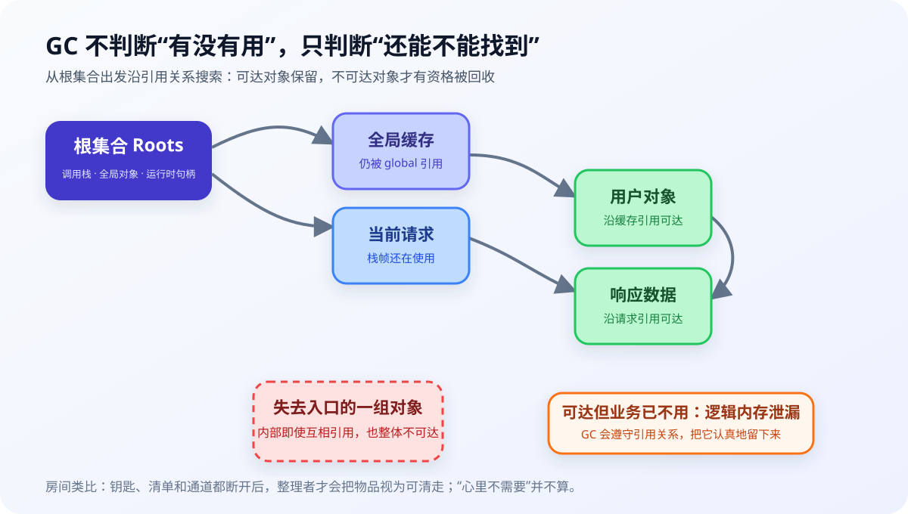
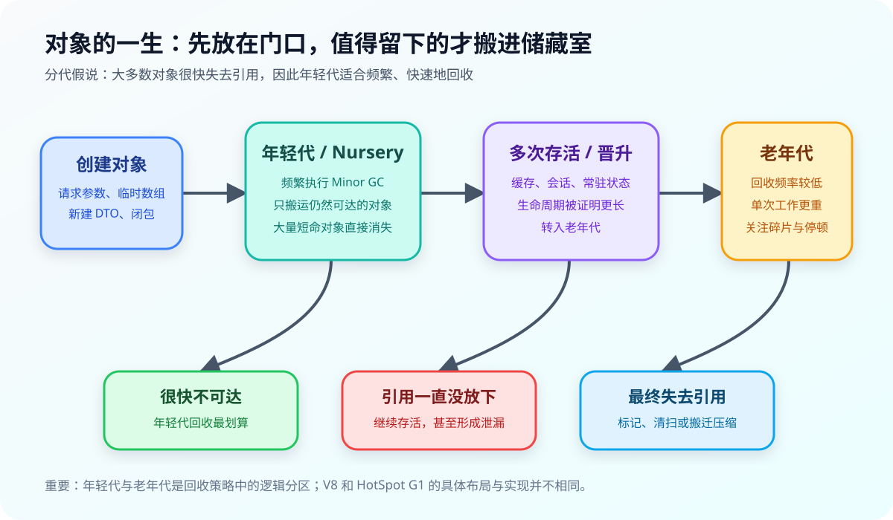

搬家后的第三个月，房间通常会出现一种奇怪的状态：真正每天使用的东西并不多，桌面和柜子却已经满了。旧快递盒觉得“下次寄东西可能用得上”，坏了一只的耳机觉得“另一只还能响”，买菜送的塑料袋则因为套着另一个塑料袋，成功组成了一个谁也不敢拆的引用环。

程序的堆内存也会变成这样。对象不断创建，有些很快完成使命，有些要陪着进程运行很久，还有些业务上早就没用了，却仍被某个缓存、监听器或定时器牢牢引用。

垃圾回收器（Garbage Collector，GC）就是运行时里的整理者。不过它没有生活经验，也不会替我们判断一件东西是否值得留下。它只执行一条冷静的规则：**还能从“必须保留的入口”找到，就留下；找不到，才可以回收。**

这条规则解释了 GC 的大部分行为，也解释了为什么有自动回收，程序仍然会内存泄漏。

## 一、GC 眼中的“有用”，其实是“可达”

假设整理房间前，我们先确定几处不能动的入口：手上正在用的东西、门口的随身包、墙上的固定柜，以及家人明确交代要保留的箱子。从这些入口出发，沿着“箱子里还有盒子”“抽屉里放着钥匙”的关系一路寻找，能找到的东西都暂时留下。

垃圾回收采用的思路很接近。在 V8 这类追踪式垃圾回收器中，GC 从一组根（roots）出发，例如当前执行栈中的引用、全局对象和运行时维护的句柄，然后沿对象之间的引用继续遍历：

```text
根 → 对象 A → 对象 B → 对象 C
```

只要存在这样一条路径，C 就是可达对象。反过来，一个对象即使占了很多内存，只要没有从根出发的路径能够到达它，就具备被回收的条件。V8 官方对 Major GC 的说明也是从根集合开始递归标记所有可达对象，再处理没有被标记的空间。



### 1. 循环引用为什么不一定泄漏

两个盒子互相装着对方的说明书，看起来谁也离不开谁：

```javascript
let boxA = {}
let boxB = {}

boxA.other = boxB
boxB.other = boxA

boxA = null
boxB = null
```

最后两行执行后，两个对象仍然互相引用，但根集合已经无法到达它们。追踪式 GC 会把这一整组对象判定为不可达，因此能够回收。

这也是追踪式 GC 与简单引用计数的重要区别。若只统计“被引用了几次”，A 和 B 的计数都不是 0，容易永远留下；若从根出发判断可达性，这个环并不特殊。

### 2. 真正麻烦的是“可达，但已经没用”

下面这个缓存会一直保存收到的数据：

```javascript
const sessions = new Map()

function rememberSession(id, payload) {
  sessions.set(id, {
    payload,
    createdAt: Date.now(),
  })
}
```

只要 `sessions` 仍由模块作用域引用，Map 中的所有键和值就都可达。即使某个会话半年前已经结束，GC 也不会擅自删除它，因为删除缓存是业务决策，不是内存管理决策。

内存泄漏可以这样理解：**数据在业务上已经没用，在引用关系上却仍然可达。** GC 能找到它，而且会非常负责地保留它。

## 二、对象的一生：先放门口，活得久再搬进储藏室

现实中的临时物品很多：刚拆下来的包装、当天的购物小票、准备明天带走的文件。如果每来一件东西都郑重地锁进储藏室，再定期翻遍全屋判断该扔什么，整理成本会高得离谱。

多数运行时利用了相似的统计规律：**大多数对象存活时间很短。** 这叫分代假说。一次请求中的参数对象、字符串拼接产生的中间值、临时数组，往往在函数返回或请求结束后就失去引用。

因此，V8 和许多 JVM 垃圾回收器都会按对象年龄组织回收工作。具体布局并不相同，但思路相近：

1. 新对象先进入年轻代，像刚到家的物品先放在门口周转区；
2. 年轻代空间较小，因此检查频繁；
3. 很快失去引用的对象直接回收；
4. 经历多次回收仍然存活的对象，会进入老年代；
5. 老年代检查频率较低，但每次需要处理的范围和关系更复杂。



这里的“年轻”和“老”描述的是对象经历过的回收周期，不是创建时间的绝对长短。一个对象被长期缓存，可能很快晋升；另一个对象虽然创建得早，只要进程期间已经不可达，也不会因为“资历老”而获得保护。

## 三、整理房间的四个动作，对应 GC 的核心算法

垃圾回收算法名称很多，拆开看主要是在回答三个问题：谁还活着、死对象留下的空间怎样复用、碎片要不要整理。

| GC 动作 | 房间里的对应动作 | 优点 | 代价 |
| --- | --- | --- | --- |
| 标记（Mark） | 从保留清单出发，给所有能找到的物品贴标签 | 能识别完整对象图，包括循环引用 | 需要遍历可达关系 |
| 清扫（Sweep） | 清走没贴标签的物品，把空位登记出来 | 不必搬动所有幸存物品 | 空位可能零散，形成碎片 |
| 复制 / 疏散（Copy / Evacuate） | 把要留的东西搬到空房间，原房间整体清空 | 回收后空间连续，分配很快 | 必须预留目标空间，还要更新引用 |
| 压缩（Compact） | 把留下的物品靠拢摆放 | 消除碎片，腾出连续空间 | 移动物品和修正引用都有成本 |

### 1. 标记—清除为什么会产生碎片

假设柜子从左到右摆着 A、B、C、D，B 和 D 已经不可达。清扫后得到：

```text
[ A ][ 空 ][ C ][ 空 ]
```

总空闲空间也许可观，但它分成了两个小洞。下一次要放一个较大的连续对象时，两个洞不能直接拼起来使用。这就是内存碎片。清扫器通常会把空闲块登记到 free list，后续按大小寻找合适的位置。

### 2. 复制为什么适合年轻代

如果一个周转区里 100 件物品有 95 件都要扔，与其逐件搬垃圾，不如只把 5 件要留下的东西搬到空区，再把原区域整体清空。复制式回收的成本更接近“幸存对象的数量”，这正好利用了年轻代死亡率高的特点。

代价是需要一块目标空间。V8 的年轻代 Scavenger 使用半空间思路，在 From-Space 与 To-Space 之间搬运仍可达的对象；搬完后交换两个空间的角色。对象移动后，所有指向旧地址的引用也必须更新。

### 3. 压缩不是为了洁癖

压缩的目标是得到大块连续空间，让后续分配可以继续快速向前推进。它会移动幸存对象，因此不是免费的。V8 的 Major GC 会根据碎片情况选择压缩部分页面，其余页面可以只清扫；现代回收器通常不会机械地每次整理全部空间。

## 四、Node.js 里的 V8：一边营业，一边整理

Node.js 使用 V8 执行 JavaScript。就 JavaScript 堆而言，可以先记住两类回收：

- **Minor GC / Scavenger**：主要处理年轻代，频率高，目标是迅速清掉大量短命对象；
- **Major GC / Mark-Compact**：面向更大范围的堆，涉及标记、清扫，以及按需压缩。

年轻代回收不能只看调用栈和全局对象。老年代对象也可能引用年轻代对象，例如一个长期缓存刚刚保存了新建的数据。若每次 Minor GC 都扫描整个老年代，分代就失去了意义。V8 使用写屏障记录“老对象指向新对象”这类关系，把它们作为年轻代回收时的额外入口。

可以把写屏障理解成仓库管理员的一条登记规则：每当储藏室里的旧箱子装进一件门口的新物品，就在登记簿上记一笔。清理门口时只需查登记簿，不必翻遍整座仓库。

### 1. Stop the World 不等于所有工作都停很久

为了稳定地移动对象或完成关键标记，GC 的某些阶段需要暂停应用线程，这就是 Stop the World（STW）。在 Node.js 中，主线程暂停意味着这段时间不能继续执行 JavaScript；停顿过长会反映为接口延迟或事件循环卡顿。

现代 V8 的 Orinoco 回收器把工作拆成不同执行方式：

- **并行（parallel）**：JavaScript 暂停，主线程和多个辅助线程一起整理。总工作量没有消失，但完成得更快；
- **增量（incremental）**：主线程一次只做一小段 GC 工作，中间继续运行 JavaScript。像整理十分钟、工作一会儿，再接着整理；
- **并发（concurrent）**：辅助线程在后台标记或清扫，主线程继续运行 JavaScript。因为对象关系还在变化，需要写屏障等机制保证结果正确。

并发 GC 也不是“完全没有停顿”。例如并发标记结束后，仍需要短暂完成最终标记与部分指针更新。工程上的目标通常是缩短最坏停顿，同时控制额外 CPU、内存和同步成本。

### 2. Node.js 进程内存不只有 V8 堆

看到进程内存上涨，不能立刻断定“V8 GC 失效”。`process.memoryUsage()` 会给出几组不同指标：

```javascript
import process from 'node:process'

const usage = process.memoryUsage()

console.table({
  rss: usage.rss,
  heapTotal: usage.heapTotal,
  heapUsed: usage.heapUsed,
  external: usage.external,
  arrayBuffers: usage.arrayBuffers,
})
```

- `heapUsed`：V8 堆中当前使用的空间；
- `heapTotal`：V8 当前管理的堆容量；
- `external`：与 JavaScript 对象绑定、但由 C++ 侧分配的内存；
- `arrayBuffers`：`ArrayBuffer`、`SharedArrayBuffer` 以及 Node.js `Buffer` 使用的内存，它也计入 `external`；
- `rss`：进程当前驻留在物理内存中的总量，范围比 V8 堆更大。

这几条曲线可能朝不同方向变化。`heapUsed` 在回收后下降，而 RSS 没有同步下降，不一定是 JavaScript 对象还活着；分配器碎片、V8 保留已提交页面以便复用、原生模块和 Buffer 都会影响进程内存。Node.js 文档还特别提到，在部分 Linux/glibc 环境中，即使 `heapTotal` 稳定，分配器碎片也可能让 RSS 持续增长。

### 3. 怎样看一次 GC 到底做了什么

启动 Node.js 时加上 `--trace-gc`：

```bash
node --trace-gc app.js
```

日志中的一条记录通常会告诉你：GC 类型、回收前后的堆使用量、总堆容量、耗时和触发原因。不要只盯着“GC 出现了多少次”，更值得观察的是：

- 相近负载下，回收后的基线是否持续抬高；
- Major GC 是否越来越频繁，回收量却越来越少；
- 单次停顿是否已经影响接口延迟；
- `heapUsed`、`external` 与 RSS 中究竟是哪一项增长。

健康服务的内存曲线常像锯齿：分配时上升，GC 后下降。泄漏更像不断上移的锯齿地板，但判断时要比较相似负载与相似 GC 阶段，不能只凭一张瞬时截图下结论。

## 五、JVM 不是一种 GC：以 HotSpot G1 为例

“JVM 的 GC 怎么工作”这个问题容易把几个层次混在一起。JVM 是规范和运行时体系；HotSpot 是常见实现；HotSpot 又提供 Serial、Parallel、G1、ZGC 等不同回收器。它们面对的是同一个基本问题，却在吞吐量、延迟、额外内存和并发开销之间做出不同选择。

HotSpot 同样从 GC Roots 判断对象是否存活。常见的根包括活动线程栈中的局部引用、类的静态字段、JNI 句柄和 JVM 内部结构。对象只要还在这些根延伸出的引用图上，就不能回收。

以 HotSpot 的 G1 为例，它不像经典示意图那样要求年轻代和老年代在物理地址上各占一整块连续区域。G1 把堆划分成大小相等的 Region，再把其中一部分逻辑上分配给 Eden、Survivor 或 Old：

```text
[ Eden ][ Old ][ Free ][ Survivor ][ Old ][ Eden ][ Free ] ...
```

它的工作节奏大致是：

1. 新对象通常进入 Eden Region；
2. Young GC 选择年轻代 Region 作为回收集合，把活对象疏散到新的 Survivor 或 Old Region；
3. 老年代占用达到条件后，G1 启动并发标记，统计各 Region 的存活情况；
4. 后续 Mixed GC 除了处理年轻代，还会选择一部分回收收益高的老年代 Region；
5. 活对象被搬走后，原 Region 可以整体复用，同时完成压缩效果。

“Garbage-First”这个名字的含义也在这里：优先选择垃圾比例较高、预计回收收益更好的区域，而不是每次把整个老年代都整理一遍。G1 会尝试满足停顿时间目标，但 Oracle 文档明确说明它不是实时回收器，单次停顿不保证绝对落在目标以内。

### V8 与 HotSpot G1 的共同框架

| 观察角度 | Node.js / V8 | HotSpot G1 |
| --- | --- | --- |
| 基本生存判断 | 从根集合追踪可达对象 | 从 GC Roots 追踪可达对象 |
| 分代思路 | Nursery、年轻代、老年代 | Eden、Survivor、Old，映射到多个 Region |
| 年轻对象回收 | Scavenger 搬运幸存对象 | Young GC 疏散选中 Region 中的活对象 |
| 长寿命对象回收 | Major GC 标记、清扫、按需压缩 | 并发标记后通过 Mixed GC 增量回收老年代 Region |
| 跨代引用 | 写屏障与 remembered information | 写屏障、Card 与 Remembered Set |
| 主要矛盾 | 主线程延迟、吞吐量、堆与外部内存 | 停顿目标、吞吐量、Region 回收收益与额外开销 |

这张表适合建立共同框架，不代表两个回收器内部实现相同。尤其不要把“JVM”等同于 G1：换成 Parallel GC 或 ZGC，内存布局、并发程度和停顿特征都会变化。

## 六、GC 管不了的东西，要靠生命周期管理

把对象变成不可达，只代表 GC 将来可以回收它占用的托管堆内存。文件描述符、数据库连接、Socket、锁和原生句柄具有外部状态，通常需要在明确的时间点关闭。

如果把 GC 当成保洁服务，那么这些资源更像借来的钥匙。钥匙最终丢进垃圾桶，不等于房东已经及时拿回钥匙；你需要主动归还。

Node.js 中可以用 `try...finally` 确保文件句柄关闭：

```javascript
import { open } from 'node:fs/promises'

const file = await open('./report.txt', 'r')

try {
  const content = await file.readFile('utf8')
  console.log(content)
} finally {
  await file.close()
}
```

Java 则提供 `AutoCloseable` 与 try-with-resources：

```java
try (var reader = Files.newBufferedReader(path)) {
    System.out.println(reader.readLine());
}
```

无论代码正常结束还是抛出异常，资源都会在离开代码块时关闭。OpenJDK 已通过 JEP 421 将 finalization 标记为待移除机制，并建议优先使用 try-with-resources；`Cleaner` 更适合作为安全网，而不是代替明确的 `close()`。

### 监听器、定时器和 ThreadLocal 也有生命周期

下面的监听器捕获了一个较大的对象：

```javascript
function subscribe(emitter, report) {
  const onData = chunk => {
    report.push(chunk)
  }

  emitter.on('data', onData)

  return () => {
    emitter.off('data', onData)
  }
}
```

只注册不注销，`emitter → onData → report` 这条引用链就可能长期存在。返回清理函数，相当于把“谁创建，谁结束”写进接口。定时器需要 `clearInterval`，Java 线程池中的 `ThreadLocal` 应在 `finally` 中 `remove()`，订阅和回调也应提供对应的取消操作。

这类问题的共同点是：GC 没有做错，缺失的是业务生命周期的终点。

## 七、把“断舍离”写进代码，而不是等内存报警

房间往往是在日常堆放中逐渐失控：东西进门时没有固定去处，后来也没有明确的离开条件。程序中的生命周期也应该在创建资源时一起设计。

### 1. 先问所有权：谁负责让它结束

创建缓存、监听器、Worker、连接或定时器时，接口应当同时回答：

- 谁持有它；
- 它应该活到请求结束、组件卸载、用户退出，还是进程退出；
- 正常完成和异常中断时分别怎样清理；
- 重复调用清理操作是否安全。

如果答案只是“以后 GC 会收”，通常还没有定义完整的生命周期。

### 2. 缓存必须有边界

缓存不是免费的储藏室。至少要有容量、过期时间或淘汰规则中的一种，生产系统通常要组合使用：

```javascript
class BoundedCache {
  #data = new Map()

  constructor(limit) {
    this.limit = limit
  }

  get(key) {
    return this.#data.get(key)
  }

  set(key, value) {
    if (this.#data.has(key)) this.#data.delete(key)
    this.#data.set(key, value)

    if (this.#data.size > this.limit) {
      const oldestKey = this.#data.keys().next().value
      this.#data.delete(oldestKey)
    }
  }
}
```

这个示例只演示容量边界，并不是完整 LRU：`get()` 没有更新访问顺序，也没有处理 TTL、并发和淘汰指标。重点是让“最多保留多少、何时失效”成为代码规则，不能靠内存暂时充足来维持缓存。

### 3. 缩短引用范围，比频繁手动触发 GC 更有效

局部变量只在需要的作用域中存在，请求数据不要挂到全局对象，完成任务后移除 Map 条目、监听器和计时器。这样做是在减少存活集；强行增加堆上限或频繁调用显式 GC，只是改变整理时间，无法让仍被引用的对象凭空消失。

`WeakMap` 适合“条目的生命完全跟随键对象”的附加数据，例如给 DOM 节点或对象实例保存元信息。它不是万能缓存：不可枚举、清理时机不确定，也不能替代明确的容量和过期策略。Java 的 `WeakReference`、`SoftReference` 同样是与 GC 协作的工具，不应拿来掩盖所有权不清。

### 4. 给系统留出空位

把柜子塞到 100% 才开始整理，移动任何一件东西都会困难。复制和疏散式 GC 也需要目标空间；并发标记期间，应用还在继续分配。堆上限不是日常使用目标，容量规划应为流量波动、回收复制、原生内存和故障恢复留出余量。

## 八、出现内存问题时，先测量再“收拾”

Node.js 可以从三层证据开始：

1. 用 `process.memoryUsage()` 区分 V8 堆、Buffer/ArrayBuffer、外部内存和 RSS；
2. 用 `--trace-gc` 观察回收类型、前后容量与停顿；
3. 在可控环境中比较堆快照或分配采样，沿 retaining path 找到是谁仍在引用目标对象。

JVM 服务可以先保留 GC 日志，再使用 `jcmd` 查看堆概况、类实例直方图或启动 JFR：

```bash
java -Xlog:gc*:file=gc.log:time,uptime,level,tags -jar app.jar

jcmd <pid> GC.heap_info
jcmd <pid> GC.class_histogram
jcmd <pid> JFR.start name=memory-check duration=60s filename=memory.jfr
```

排查时不要先执行 `System.gc()` 或重启进程，然后把暂时下降的曲线当成修复。更有价值的问题是：哪类对象数量持续增加？从 GC Roots 到它的保留路径是什么？增长是否与某个接口、租户、任务或发布相关？回收后的老年代基线是否在相似负载下持续上升？

一旦找到引用链，修复往往不在 GC 参数里，而在那条没有终点的生命周期里。

## 九、GC 留下的生活提示

GC 给生活最直接的启发，是把整理变成几条具体规则，而非追求“扔得越多越好”。

临时物品应该待在容易清理的区域。真正长期使用的东西，才值得占据稳定空间。一个东西已经没用，却仍被清单、抽屉或另一个盒子关联着，整理者不会替主人猜出真实意图。外借的钥匙和需要关闭的连接，也不能等大扫除顺便解决。

减少混乱最有效的时机通常是物品进入房间时。它归谁、放多久、超过多少要淘汰、离开时由谁收尾，这些问题一旦有了答案，程序和房间都不必等到空间耗尽，再经历一次痛苦的大扫除。

GC 能替我们回收已经放下的对象。至于什么时候放下，仍然是程序员自己的职责。

## 参考资料

- [V8：Trash talk—The Orinoco garbage collector](https://v8.dev/blog/trash-talk)
- [V8：Orinoco young generation garbage collection](https://v8.dev/blog/orinoco-parallel-scavenger)
- [Node.js：Understanding and Tuning Memory](https://nodejs.org/learn/diagnostics/memory/understanding-and-tuning-memory)
- [Node.js：Tracing garbage collection](https://nodejs.org/learn/diagnostics/memory/using-gc-traces)
- [Node.js：process.memoryUsage() 文档](https://nodejs.org/api/process.html#processmemoryusage)
- [Oracle Java 25：Garbage-First Garbage Collector](https://docs.oracle.com/en/java/javase/25/gctuning/garbage-first-g1-garbage-collector1.html)
- [Oracle Java 25：Available Collectors](https://docs.oracle.com/en/java/javase/25/gctuning/available-collectors.html)
- [OpenJDK JEP 421：Deprecate Finalization for Removal](https://openjdk.org/jeps/421)
- [Oracle Java Tutorial：The try-with-resources Statement](https://docs.oracle.com/javase/tutorial/essential/exceptions/tryResourceClose.html)
